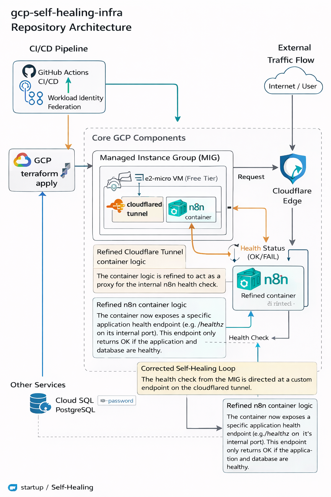

# GCP Self-Healing Infrastructure for n8n

[](https://github.com/oleiarme/gcp-self-healing-infra/actions/workflows/deploy.yml)

Production-grade self-healing infrastructure on **GCP Free Tier** that automatically recovers n8n if it crashes — using Managed Instance Group (MIG), health checks, and Cloudflare Tunnel.

## Architecture

```
┌──────────────────────────────────────────────────────────┐
│                    GitHub Actions CI/CD                   │
│              (Workload Identity Federation)               │
└──────────────────────┬───────────────────────────────────┘
                       │ terraform apply
                       ▼
┌──────────────────────────────────────────────────────────┐
│                   GCP us-central1-a                       │
│                                                           │
│  ┌───────────────────────────────────────────────────┐   │
│  │            Managed Instance Group (MIG)           │   │
│  │                                                   │   │
│  │  ┌─────────────────────────────────────────────┐  │   │
│  │  │           e2-micro VM (Free Tier)           │  │   │
│  │  │                                             │  │   │
│  │  │  ┌─────────────┐   ┌──────────────────┐   │  │   │
│  │  │  │    n8n      │   │   cloudflared    │   │  │   │
│  │  │  │   :5678     │◄──│   Tunnel         │   │  │   │
│  │  │  └─────────────┘   └──────────────────┘   │  │   │
│  │  │         │                    │              │  │   │
│  │  └─────────┼────────────────────┼─────────────┘  │   │
│  │            │                    │                 │   │
│  │   Health Check /healthz    Cloudflare Edge        │   │
│  │   (auto-restart on fail)   (HTTPS, no open IP)    │   │
│  └───────────────────────────────────────────────────┘   │
│                                                           │
│  ┌──────────────┐   ┌──────────────────┐                 │
│  │  Cloud SQL   │   │ Secret Manager   │                 │
│  │  PostgreSQL  │   │  db-password     │                 │
│  └──────────────┘   └──────────────────┘                 │
└──────────────────────────────────────────────────────────┘
```

## How Self-Healing Works

1. **In-cluster liveness** — GCP HTTP health check polls `/healthz` on the
   VM every **10s** (timeout 5s). 2 successes → healthy, 5 failures →
   unhealthy (~50s detection window).
2. **Docker container healthcheck** — the `n8n` container self-reports
   health every 10s after a **420s** `start_period` grace window
   (Docker-level, mirrors the GCP interval so there is no stale-health
   window where GCP reads healthy while n8n is already dead).
3. **MIG auto-healing** — unhealthy status triggers VM replacement.
   `initial_delay_sec = 600s` (> Docker `start_period` + 3 min safety)
   lets `startup.sh` reach `/healthz` OK before any replacement timer
   starts, preventing cold-boot loops on e2-micro.
4. **New VM runs `startup.sh`** → apt update → install Docker → pull n8n
   and cloudflared images → start containers → run n8n DB migrations.
5. **Recovery time budget:**
   - Cold start (scratch boot): ≤ 17 min (600s initial_delay + 50s
     detection + ~6 min startup).
   - Warm replace (template change, no initial_delay): ≤ 6 min.
   - See the [SLO section](#slo--sli) for the SLI-side target (10 min).
6. Zero manual intervention required.

## Stack

| Component | Technology | Why |
|---|---|---|
| IaC | Terraform | Reproducible infra |
| Compute | GCP e2-micro | Free Tier (always free) |
| Self-healing | MIG + Health Check | Auto-replace crashed VM |
| Workflow engine | n8n | Open-source automation |
| Database | Cloud SQL PostgreSQL | Persistent state |
| Secrets | GCP Secret Manager | No plaintext credentials |
| Tunnel | Cloudflare Tunnel | HTTPS without public IP |
| CI/CD | GitHub Actions + WIF | Keyless authentication |

## Prerequisites

- GCP project with billing enabled
- GCS bucket for Terraform state
- Cloud SQL PostgreSQL instance
- Cloudflare Tunnel token
- GitHub repository secrets configured

## Quick Start

### 1. Clone & configure

```bash
git clone https://github.com/oleiarme/gcp-self-healing-infra.git
cd gcp-self-healing-infra/terraform
cp terraform.tfvars.example terraform.tfvars
# Edit terraform.tfvars with your values
```

### 2. Create backend config (never commit this file)

```bash
cat > backend.conf <<EOF
bucket = "your-terraform-state-bucket"
prefix = "terraform/state"
EOF
```

### 3. Deploy locally

```bash
terraform init -backend-config=backend.conf
terraform plan
terraform apply
```

### 4. Deploy via GitHub Actions

Add these to **Settings → Secrets and variables → Actions**:

**Secrets:**
| Name | Description |
|---|---|
| `WIF_PROVIDER` | Workload Identity Federation provider |
| `WIF_SA` | Service account email for WIF |
| `TF_BACKEND_BUCKET` | GCS bucket name for Terraform state |
| `TF_VAR_CF_TUNNEL_TOKEN` | Cloudflare Tunnel token |
| `TF_VAR_db_password` | PostgreSQL password |
| `TF_VAR_n8n_encryption_key` | n8n encryption key (random 32-char string) |

**Variables (non-secret):**
| Name | Description |
|---|---|
| `TF_VAR_project_id` | GCP project ID |
| `TF_VAR_db_host` | Cloud SQL private IP |
| `TF_VAR_db_user` | PostgreSQL username |

Push to `main` → CI/CD deploys automatically.

## Free Tier Compliance

- **VM**: e2-micro (2 vCPU, 1 GB RAM) — always free in us-central1
- **Disk**: 30 GB standard — within free tier
- **Network**: STANDARD tier
- Built-in guard checks disk/VM count before every apply

## SLO / SLI

| Metric | Target | How measured |
|--------|--------|--------------|
| **Availability** | 99.5% over 28d rolling | External uptime check on `https://<n8n_public_host>/healthz`, 6 probe locations, 60s period (see `terraform/monitoring.tf`) |
| **Recovery time** | Cold ≤ 17 min, Warm ≤ 7 min | `initial_delay_sec` + HC detection + startup.sh — see [How Self-Healing Works](#how-self-healing-works) |
| **In-cluster HC interval** | 10s | GCP polls `/healthz` every 10s with 5s timeout |
| **Startup grace period** | 420s | Docker `start_period` before n8n reports healthy/unhealthy |

**Error budget:** 3.6h downtime/month (0.5%) is acceptable.
If the 28d error budget is consumed > 50% → weekly reviews until month end.
If consumed 100% → release freeze per `docs/error-budget-policy.md` (Phase 5).

**What this does NOT cover:**
- Cloud SQL availability (managed by GCP, separate SLA)
- Cloudflare Tunnel availability (status.cloudflare.com)
- Network partition between VM and database

## Observability & Alerting

Defined as code in `terraform/monitoring.tf` and `terraform/dashboards.tf`.

### External SLI probe
`google_monitoring_uptime_check_config.n8n` hits `https://<n8n_public_host>/healthz` every 60s from all default probe locations and requires a 2xx response whose body contains `ok`. This is the single source of truth for the 99.5% availability SLI.

### Burn-rate alerts (multi-window, multi-burn-rate, Google SRE Workbook)

| Policy | Signal | Burn rate | Trigger | Severity | Channels |
|---|---|---|---|---|---|
| `n8n SLO fast burn` | uptime good-fraction < 0.928 over **1h** | 14.4× (2% of 28d budget / 1h) | within 1h window | **CRITICAL** | email |
| `n8n SLO slow burn` | uptime good-fraction < 0.97 over **6h** | 6× (5% of 28d budget / 6h) | within 6h window | WARNING | email |
| `n8n startup script CRITICAL` | log-based metric `n8n/startup_critical` > 0 in 5m | n/a | 1 event | WARNING | email |

All alert policies carry a `runbook` user-label that deep-links to `Runbook.md` so the on-call engineer lands on the triage page directly from the alert.

### Notification channels
- `TF_VAR_oncall_email` — required. Primary on-call email.
- **Slack** — intentionally deferred. A Slack incoming-webhook URL embeds its own auth token in the path, which would leak through Terraform state and the Cloud Monitoring API if plumbed into a `webhook_tokenauth` channel. Slack delivery will be added in a later phase using the native `type = "slack"` channel with an OAuth token held in `sensitive_labels`.

### Log ingestion
`scripts/startup.sh` installs the Ops Agent with a deliberately **logging-only** config (`/etc/google-cloud-ops-agent/config.yaml`). Host- and process-metrics receivers are off — they exceeded the e2-micro IO budget historically (commit `del ops agent not enouth io`). The single tail receiver on `/var/log/startup.log` is what feeds the `n8n/startup_critical` log-based metric.

### Dashboard
`google_monitoring_dashboard.n8n_slo` is rendered from `terraform/dashboards/n8n-slo.json.tftpl` and carries four tiles: uptime good-fraction, 1h/6h burn rate with alert thresholds, MIG instance count, and startup CRITICAL events counter. The `dashboard_id` output gives a direct link.

### Design note on `google_monitoring_slo`
A formal `google_monitoring_slo` resource is intentionally **not** created in this phase — the SLO report-card semantics for boolean uptime metrics (windows-based vs request-based ratio) warrant their own review. Burn-rate alerting does not need that resource; both alert policies compute the burn rate directly from the uptime-check metric via MQL, which is the canonical, unambiguous definition. The SLO resource can be added later for the Cloud Monitoring UI report without changing alerting behaviour.

## Outputs

After `terraform apply`, get key resource names for debugging and alerting:

```bash
terraform output -json | jq '{
  mig_name,
  health_check_name,
  vm_service_account_email,
  secret_names
}'
```

| Output | Use case |
|--------|----------|
| `mig_name` | Identify MIG in GCP Console |
| `health_check_name` | Set up Cloud Monitoring alerting |
| `vm_service_account_email` | Filter logs by service account |
| `secret_names` | Quick reference for rotation script (Scenario 3 in Runbook) |
| `deployment_timestamp` | Correlate changes across environments |

## Runbook

For incident response procedures see [Runbook.md](Runbook.md):
- **Scenario 1:** MIG recreated VM (health check failed)
- **Scenario 2:** Startup timeout / boot-loop
- **Scenario 3:** Secret rotation (DB password, n8n key, Cloudflare token)
- **Scenario 4:** MIG update / terraform redeploy

## Project Structure

```
.
├── .github/
│   └── workflows/
│       └── deploy.yml        # CI/CD pipeline
│       └── terraform.yml     # terrafrom validate
├── scripts/
│   └── startup.sh            # VM bootstrap script
├── terraform/
│   ├── main.tf # Core infrastructure
│   ├── variables.tf # Input variables
│   ├── outputs.tf # Terraform outputs for debugging/alerting
│   └── terraform.tfvars.example # Config template
├── Runbook.md # Incident response procedures
└── README.md
```
